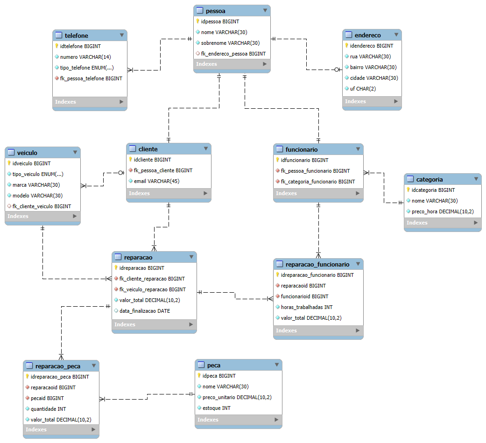

## API Departamento de Reparos de Veículos

>  Api desenvolvida a fim de pôr em prática os meus conhecimentos em Java e Spring Boot

Este repositório contém somente o **Backend** do projeto.

---

## 🎯 Funcionalidades

* ✅ **Cadastro de Clientes**  
  Permite o cadastro, consulta e exclusão de clientes. Também possibilita visualizar os veículos e reparos associados a um cliente.

* ✅ **Cadastro de Veículos**  
  Permite o cadastro, consulta e exclusão de veículos. Os veículos são associados aos clientes, permitindo a consulta de todos os veículos registrados para um determinado cliente.

* ✅ **Cadastro de Funcionários**  
  Permite o cadastro, consulta e exclusão de funcionários, além de associá-los a reparos específicos.

* ✅ **Cadastro de Reparos**  
  Cadastro de reparos realizados, incluindo informações sobre os funcionários e peças associadas. Permite adicionar ou remover funcionários e peças de reparos existentes.

* ✅ **Manipulação de Funcionários e Peças em Reparos**  
  Permite associar ou desassociar funcionários e peças a reparos específicos.
  
* ✅ **Controle do estoque de Peças**  
  Permite controlar o estoque de peças, conforme a mesma é utiliza em reparos.

* ✅ **Atualizar dados de Cliente e Funcionário**  
  Permite atualizar dados de clientes e funcionários, como nome, telefone, endereço, categoria para funcionários e e-mail para clientes.

* ✅ **Consultas Avançadas**
    - **Filtrar Clientes por Nome**: Permite buscar clientes por nome.
    - **Filtrar Reparos por Data**: Possibilita filtrar os reparos realizados por data.
    - **Visualizar Funcionários e Peças Associados a um Reparo**: Para cada reparo, é possível consultar os funcionários e as peças utilizados.
    - **Visualizar Veículos e Reparos de um Cliente**: Permite listar os veículos e os reparos registrados para um cliente específico.

## 🛠️ Tecnologias Utilizadas

-  - Linguagem de programação utilizada.
-  - Framework para criação de APIs REST em Java.
-  - Framework para mapeamento objeto-relacional.
-  - Framework ORM para persistência de dados.
-  - Conteinerização do Banco de dados.
-  - Banco de dados utilizado.
-  - Gerencia dependências e automação de builds para projetos Java.

---

## 💾 Banco de Dados

### 📐 Estrutura do Banco
- Abaixo está o diagrama que representa a estrutura do banco de dados utilizada no projeto:

<div style="text-align: center;">
  
</div>

### 📄 Observações
- A aplicação utiliza um schema SQL personalizado (escrito manualmente) para a criação das tabelas do banco.
- Você pode visualizar esse script diretamente no arquivo `src/main/resources/db/schema.sql`

## 🚀 Como Rodar a API

### 1. Clone o Repositório
- Primeiro, clone o repositório:
    ```
        git clone https://github.com/mbranches/api-departamento-reparos.git
        cd api-departamento-reparos
    ```
  
### 2. Popule as variáveis de ambiente.

#### a. **Variável Docker**
- Renomeie o arquivo da raíz do repositório `.envTemplate` para `.env` e preencha a variável com o valor desejado para o seu ambiente de desenvolvimento.

#### b. **Variável Spring Boot (`src/main/resources`)**
- Navegue até o diretório `src/main/resources`
- Renomeie o arquivo `.envTemplate` para `.env` e configure `ENV_ROOT_PASSWORD` igual o definido no `.env` da raíz do projeto.

### 3. Rode o docker
- A partir da raíz do repositório rodar o seguinte comando:
    ```
      docker-compose up -d
    ```

### 4. Instalação do Maven
- Certifique-se de ter o Maven instalado no seu computador. Caso não tenha, clique [aqui](https://dicasdeprogramacao.com.br/como-instalar-o-maven-no-windows/) para ter acesso ao tutorial.

### 5. Inicialize o Spring Boot
- Com o docker rodando é só inicializar a API com os seguintes comandos:
    ```
      mvn clean install
      mvn spring-boot:run
    ```
  
## 🧪 Testes

O projeto possui mais de 220 testes automatizados para garantir a qualidade do código e o funcionamento correto da aplicação. A aplicação possui duas categorias de testes:

### Testes Unitários
- Testes da camada de serviço, que garantem que a lógica de negócio funcione corretamente.
- Utilizam `JUnit` para estruturação dos testes, `Mockito` para mockar dependências e `AssertJ` para asserções fluentes.

### Testes de Controller (Camada Web)
- Validam o comportamento dos endpoints REST da aplicação em isolamento.
- Configurados com `@WebMvcTest` inicializam apenas os beans da camada de controller sem carregar todo o contexto do Spring.
- Utilizam `MockMVC` para simular requisições HTTP.
- Testam os status HTTP e os payloads das requisições e respostas.
- Testam os Beans Validation das classes DTO

### Para rodar os testes, execute o seguinte comando na raiz do projeto:
```
   mvn test
```

## 🚀 Como Consumir a API com Postman

### O que é o Postman?

O **Postman** é uma ferramenta popular para testar e consumir APIs. Ele permite que você faça requisições HTTP de forma simples e intuitiva, além de visualizar respostas, testar diferentes cenários e automatizar testes de APIs. Usar o Postman é uma forma prática de interagir com a **API Departamento de Reparos de Veículos**, permitindo que você envie dados, faça consultas e visualize as respostas da API sem precisar escrever código.

### Por que Usar o Postman nesta Aplicação?

Usar o **Postman** para consumir a API facilita o processo de desenvolvimento e testes. Com ele, você pode:

- Testar as rotas da API de forma rápida e fácil.
- Interagir com a API.
- Explorar todas as funcionalidades disponíveis (CRUD de Reparos, Clientes, Funcionários etc.).
- Organizar e salvar requisições para reutilização posterior.

### Como Importar a Collection para o Postman

1. **Baixar o Arquivo da Collection**:  
   Na pasta `data` do repositório, você encontrará um arquivo chamado `Departamento.postman_collection.json`. Esse arquivo contém todas as rotas da API, prontas para serem usadas no **Postman**.

2. **Abrir o Postman**:  
   Caso não tenha o Postman instalado, você pode baixá-lo gratuitamente no [site oficial](https://www.postman.com/downloads/), caso já tenha o **Postman**, mas não sabe usar, clique [aqui](https://www.youtube.com/watch?v=64-O-dDR7ic-) para assistir um tutorial introdutório.

3. **Importar a Collection**:
  - Abra o **Postman**.
  - Clique em **Import** no canto superior esquerdo da tela.
  - Selecione o arquivo `Departamento.postman_collection.json` que você baixou da pasta `data`.
  - Após a importação, todas as rotas estarão disponíveis no **Postman**.

4. **Configuração da URL**:  
   Ao importar a collection, as rotas da API estarão configuradas para a url padrão. Caso não tenha alterada a porta, a URL da API é ``http://localhost:8080``.

5. **Consumindo a API**:  
   Agora, você pode começar a testar a API, realizando operações como:
  - **Cadastrar um Cliente** (POST)
  - **Consultar Reparos que um Cliente fez** (GET)
  - **Filtrar Reparos por data** (GET)
  - **Atualizar dados de um Cliente** (PUT)
  - **Excluir um Cliente** (DELETE)

   Agora, basta explorar, testar e interagir com a API de forma prática e eficiente utilizando o **Postman**. 🚀
